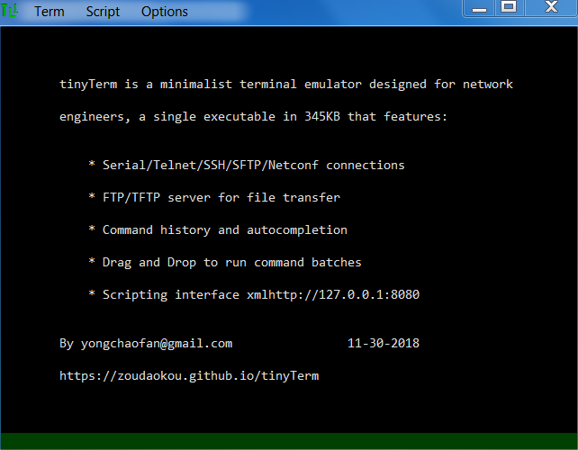

# [tinyTerm](http://yongchaofan.github.io/tinyTerm)

 

*Minimalist terminal emulator, designed by network engineer for network engineers, with unique features for effeciency and effectiveness when managing network devices like routers, switches, transponders and ROADMs through command line interface.*

## Project philosophy
tinyTerm is intended to be small, simple and scriptable, WIN32 executable is only 352KB, source code is consist of 7 files totaling 140KB, ~5000 sloc, only required external dependency is libssh2. 

User interface design is minimal too, there is one window, main menu shares title bar space, scrollbar hidden until user trys to scroll back, only one dialog for makeing connections, 

## Building
Makefiles are provided for building with MSYS2+MingW64/32

    Makefile    building 32bit tinyTerm.exe for Windows 7/10 using wincng crypto
    Makefile64  building 64bit tinyTerm64.exe for Windows 7/10 using wincng crypto
    MakefileXP  building 32bit tinyTermXP.exe for Windows XP/7/10 using mbedtls crypto

### Librarys
    libssh2 using any daily snapshot after March, 2018 for full support of WinCNG crypto functions
            ./configure --with-crypto=wincng
            make install
            
    mbedTLS Since Windows XP doesn't have WinCNG support, external crypto library has to be used, 
            download mbedtls-2.7.9, "make WINDOWS_BUILD=1 no_test install", then build libssh2
            ./configure --with-crypto=mbedtls
            make install
            
### Soruce files
    tiny.h  header file for all function definitions
    tiny.c  winmain and UI functions
    term.c  simple xterm compatible terminal implementation
    host.c  serial and telnet host implementation
    ssh2.c  ssh/sftp/netconf host implementation based on libssh2
    ftpd.c  ftp and tftp server implementation
    auto_drop.c COM wrapper for auto completion and drag&drop function
    

## Contributing
Interested in contributing to tinyTerm? I'd love your help. tinyTerm is made an open source project for users and developers to contribute and make it better together. See [the CONTRIBUTING file](docs/CONTRIBUTING.md) for instructions on how to contribute.

## Roadmap
See the [open issues](https://github.com/zoudaokou/tinyTerm/issues) for a list of proposed features (and known issues).
