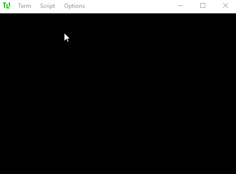
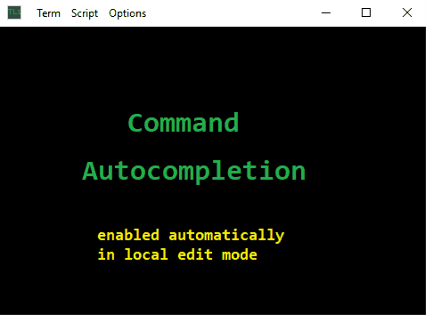
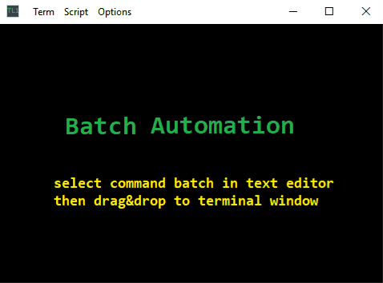
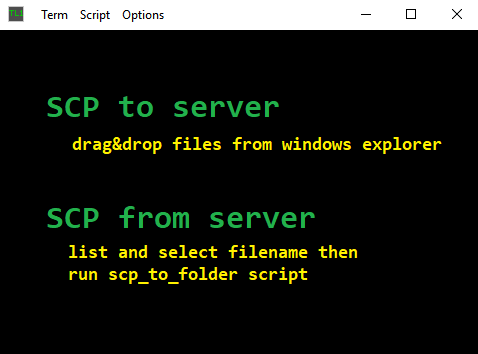
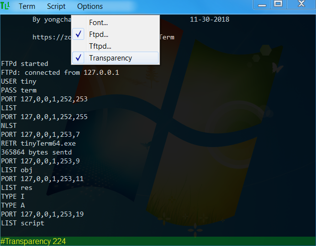

## Introduction

Network engineers commonly use terminal emulator to send CLI commands to network devices, and frequently face challenges like:

	. what's the syntax of that magic command I used last time?
	. have to send 100 commands to 10 devices, that's a lot of typing!
	. scripting
	
tinyTerm is an open source terminal emulator designed to network engineers with features like:

	**command hsitory and autocompletion**
	**command batch and automation**
	**scripting interface for extension**

## Terminal Emulation

At first glance, tinyTerm is just another terminal emulator, operates just like any other emulators. User interface design takes minimallist philosophy like putty, and goes even further as to integrate munu bar into title bar, hide srollbar until scrolling back, only one dialog for connection making. 

Five types of connections supported: serial, telnet, ssh, sftp and netconf. 
For serial connections, available serial ports are auto detected and added to the ports drop down list.
Making new connection will automatically add an entry to Term menu, simply select the menu entry to make the same connection again. 




## command history and autocompletion

**Autocomplete** is a unique feature of tinyTerm, which can be enabled through the Options menu or Alt-A, cursor changes from horizontal bar to vertical line when enabled. In autocomplete mode, key presses are not sent until user presses "Enter" key, and the input is auto completed using command history, every command typed in autocomplete mode is added to command history to complete future inputs.

Command history is saved to tinyTerm.hist at exit, then loaded into memory at the next start of tinyTerm. Since the command history file tinyTerm.hist is just a plain text file, user can edit the file outside of tinyTerm to put additional commands in the list for command auto-completion. For example put all command TL1 commands in the history list to use as a dictionary.



In autocomplete mode, when special characters “!,/” is typed at the beginning of a command, the command will be executed by tinyTerm instead of sending to remote host, for functions like making connection, search scroll buffer, set terminal options, scp file transfer or ssh tunnel setup etc. 
See Appendix A for list of supported special commands.


## command batch automation

**Automation** is another unique feature of tinyTerm, which can take a list of commands, send to remote host one at a time. Contrary to popular terminal programs, tinyTerm will not send all commands at once, risking overflow of the input buffer at remote host or network device, instead tinyTerm will wait for the prompt string from remote host before sending each command. Most command line interface system uses a prompt string to tell user it’s ready for the next command, for example “> “or “$ “used by Cisco routers. 

tinyTerm will auto detect the prompt string used by remote host when user is typing commands interactively, and use the detected prompt string during scripting. Additionally, prompt string can be set in the script using special command “!Prompt {str}”, refer to appendix A for details and other special commands supported for scripting. 



To automate the execution of commands, simply drag and drop from text editor to the input line in autocomplete mode, or select "Run..." from Script menu and select a text file with all the commands need to be executed. 

## Create Extension

tinyTerm has a xmlhttp interface built in at 127.0.0.1:8080 for advanced scripting. VBScript and JavaScript are two of the scripting languages that can take advantage of the xmlhttp interface. Files in the script folder will be listed in the script menu, select one to execute, or use "Run..." to choose a script file from the file system. 
The screen capture below shows the execution of scp_download.js from script menu, which retrieves the selected filename “tinyTerm.exe” and uses “!scp” command to download from remote host, all operation are performed using xmlhttp://127.0.0.1:8080 to send command through tinyTerm. When multiple instance of tinyTerm are started, each instance will use a unique port number starting from 8080 and counting up, 8081, 8082...etc. Special commands supported on the xmlhttp interface:

	!Disp {str}	Display {str} in terminal window
	!Recv		Return scroll buffer content since last Disp/Recv/Send command
	!Send {cmd}	Send command and return immediately
	!Selection	Get current text selection



```js
// Javascript to download a highlighted file via scp.
var xml = new ActiveXObject("Microsoft.XMLHTTP");
var port = "8080/?";
if ( WScript.Arguments.length>0 ) port = WScript.Arguments(0)+"/?";
var filename = term("#Selection");
term("#scp :"+filename+" .");

function term( cmd )
{
   xml.Open ("GET", "http://127.0.0.1:"+port+cmd, false);
   xml.Send();
   return xml.responseText;
}
```

## Options

While the user interface is minimal, there are a few options to customize through Options menu, like font face and font size, window transparency for example. All of the options can be set with command through the editor line or scripts. See appendix A for list of all supported commands. 
A built in FTP server can be used for simple file transfer tasks, like software download to network devices. Only one user name "tiny" is allowed to login, with password "term". For security, user session to the FTP server is timed out in 1 minute without action, and FTP server will time out in 15 minutes without active connection.
Similarly a built in TFTP server can be used for file transfer with simpler devices like cable modems. TFTP server times out after 5 minutes. 

For ssh/sftp/netconf connections, command line options are supported 
-l username, -pw password, -pp passphrase, -P destination port
Private key based authentication is supported too, key file should be stored in $USER/.ssh folder, as is the knownhost file for host verification. 





## Appendix A. List of special command for editor line and scripting

### Connection
	
	!com3:9600,n,8,1		serial connection to port com3 using settings 9600,n,8,1
	!telnet 192.168.1.1		telnet to 192.168.1.1
	!ssh 192.168.1.1		ssh to host 192.168.1.1
	!sftp -l admin 192.168.1.1	sftp to host 192.168.1.1 with user admin
	!netconf -P 830 192.168.1.1	netconf to port 830 of host 192.168.1.1
	!disconn			disconnect from current connection
	!{DOS command}		execute command and display result, e.g. ping 192.168.1.1

### Options
	
	!TermSize 100x40		set terminal window size to 100 columns x 40 rows
	!Transparency 192		set window transparency level to 192/255
	!FontFace Consolas		set font face to “Consolas”
	!FontSize 18			set font size to 18

### Scripting
	
	!Clear				set clear scroll back buffer
	!Prompt $%20		set command prompt to “$ “, for batch command execution
	!Timeout 30			set time out to 30 seconds for batch command execution
	!Wait 10			wait 10 seconds during batch command execution
	!Waitfor 100%		wait for “100%” from during batch command execution
	!Loop 2			repeat two times from start of script
	!Log test.log			start/stop logging with log file test.log

### Extending
	
	!Disp test case #1		display “test case #1” in terminal window
	!Send ping 192.168.1.1	send “ping 192.168.1.1” to host
	!Recv				get all text received since last Disp/Send/Recv command
	!Echo				toggle local ech on/off
	!Selection			get current selected text

	!Ftpd c:/tmp			start/stop ftp server using c:/tmp as root directory
	!Tftpd c:/tmp			start/stop tftp server using c:/tmp as root directory

	!scp test.txt :test1.txt		secure copy local file test.txt to remote host as test1.txt
	!scp :test1.txt d:/ 		secure copy remote file test1.txt to local d:/test1.txt

	!tun				list all ssh2 tunnels 
	!tun 3256			terminal ssh2 tunnel number 3256
	!tun 127.0.0.1:2222 127.0.0.1:22
					start ssh2 tunnel from localhost port 2222 to remote host port 22
