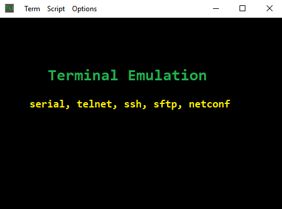

## Introduction

tinyTerm started as a simple telnet client used to work with telecom transport equipment using the TL1 command line user interface. Over the years it has grown to a full function terminal emulator with support of serial, telnet, ssh, sftp and netconf connections, xterm emulation plus some unique features like: --command autocompletion--, --scp integration-- and --batch automation--. 
	
<table>
	<tr>
	    <td>
		<h3>
			License: GPL 3.0<br/>
			Stable release: 1.2<br/>
			Installation: Microsoft Store<br/>
			Portable app:<br/>
				tinyTerm.exe(x86)
				tinyTerm64.exe(x64)
		</h3>
	    </td>
	    <td>
		
	    </td>
	</tr>
</table>

Current stable release is 1.2, [license GPL 3.0](https://github.com/yongchaofan/tinyTerm/blob/master/LICENSE)

Windows 10 user should install from microsoft store to avoid smartscreen warnings
	  
Users running earlier versions of Windows, or prefer the portable version, download and extract tinyTerm.zip

---

## Usage notes

### Making Connection
Each time a connection is made using the connect dialog, an entry will be added to the Term menu, simply select the menu entry to make the same connection again. When choosing serial protocol in connection dialog, available serial ports will be auto detected and added to the ports dropdown list.

### Command Autocompletion
When local edit mode is enabled, key presses are not sent to remote host until "Enter" key is pressed, and the input is auto completed using command history, every command typed in local edit mode is added to command history to complete future inputs. Command history is saved to tinyTerm.hist at exit, then loaded into memory at the next start of tinyTerm. 

Default command history file location is %USERPROFILE%\documents\tinyTerm\tinyTerm.hist, copy tinyTerm.hist to the same folder as tinyTerm.exe for portable usage. Since the command history file is just a plain text file, user can edit the file outside of tinyTerm to put additional commands in the list for command auto-completion. For example put all command TL1 commands in the history list to use as a dictionary.

### Batch Automation
To automate the execution of commands, simply drag and drop a list of commands from text editor, or select "Run..." from Script menu and select a text file with all the commands to be executed, tinyTerm send one command at a time, wait for prompt string before sending the next command, to avoid overflowing the receive buffer of the remote host or network device. 

Most command line interface system uses a prompt string to tell user it’s ready for the next command, for example "> " or "$ " used by Cisco routers. tinyTerm will auto detect the prompt string used by remote host when user is typing commands interactively, and use the detected prompt string during scripting. Additionally, prompt string can be set in the script using special command "!Prompt {str}", refer to appendix A for details and other special commands supported for scripting. 

### SCP integration
When a SSH or SFTP session is established in tinyTerm, simply drag and drop files to the terminal window will cause those files been transfered to remote host using SCP or SFTP put, remote files will be created in the current directory. 

To copy file from server to a local folder, simple select the filename in the terminal windows, then chose "scp_to_folder.js" from script menu. 

### FTPd/TFTPd
A built in FTP server can be used for simple file transfer tasks, like software download to network devices. Only one user name "tiny" is allowed to login, with password "term". For security, user session to the FTP server is timed out in 1 minute without action, and FTP server will time out in 15 minutes without active connection.

Similarly a built in TFTP server can be used for file transfer with simpler devices like cable modems. TFTP server times out after 5 minutes. 

---

## Extending tinyTerm

Built in xmlhttp interface at 127.0.0.1:8080 allows tinyTerm to be controled programmatically. VBScript and JavaScript are two of the scripting languages that can take advantage of the xmlhttp interface. 

The script scp_to_folder.js referenced in the previous section, is a perfect example of extending tinyTerm with scripting

```js
// Javascript to download a highlighted file via scp.
var xml = new ActiveXObject("Microsoft.XMLHTTP");
var port = "8080/?";
if ( WScript.Arguments.length>0 ) port = WScript.Arguments(0)+"/?";
var filename = term("!Selection");
var objShell = new ActiveXObject("Shell.Application")
var objFolder = objShell.BrowseForFolder(0, "Destination", 0x11, "")
if ( objFolder ) term("!scp :"+filename+" "+objFolder.Self.path);

function term( cmd )
{
   xml.Open ("GET", "http://127.0.0.1:"+port+cmd, false);
   xml.Send();
   return xml.responseText;
}
```

In line edit mode, when special characters “!” is typed at the beginning of a command, the command will be executed by tinyTerm instead of sending to remote host, for functions like making connection, search scroll buffer, set terminal options, scp file transfer or ssh tunnel setup etc. 

## list of supported special commands:

### Connection
    !com3:9600,n,8,1	connect to serial port com3 with 9600,n,8,1
    !telnet 192.168.1.1	telnet to 192.168.1.1
    !ssh pi@192.168.1.1	ssh to host 192.168.1.1
    !sftp 192.168.1.1	sftp to host 192.168.1.1 with user admin
    !netconf rtr1:830	netconf to port 830 of host 192.168.1.1
    !disconn		disconnect from current connection
    !{DOS command}	execute command and display result, e.g. ping 192.168.1.1
    !Find {string}	search for {string} in current scroll buffer

### Automation
    !Clear		set clear scroll back buffer
    !Prompt $%20	set command prompt to “$ “, for batch command execution
    !Timeout 30		set time out to 30 seconds for batch command execution
    !Wait 10		wait 10 seconds during batch command execution
    !Waitfor 100%	wait for “100%” from during batch command execution
    !Loop 2		repeat two times from start of script
    !Log test.log	start/stop logging with log file test.log

### Scripting
    !Disp test case #1	display “test case #1” in terminal window
    !Send exit		send “exit” to host
    !Recv		get all text received since last Send/Recv
    !Echo		toggle local ech on/off
    !Selection		get current selected text

### Options
    !TermSize 100x40	set terminal size to 100 cols x 40 rows
    !Transparency 192	set window transparency level to 192/255
    !FontFace Consolas	set font face to “Consolas”
    !FontSize 18	set font size to 18

### Extras
    !Ftpd c:/tmp	start/stop ftp server using c:/tmp as root directory
    !Tftpd c:/tmp	start/stop tftp server using c:/tmp as root directory

    !scp tt.txt :t1.txt	secure copy local file test.txt to remote host as test1.txt
    !scp :t1.txt d:/ 	secure copy remote file test1.txt to local d:/test1.txt

    !tun 127.0.0.1:2222 127.0.0.1:22 
    			start ssh2 tunnel from localhost port 2222 to remote host port 22
    !tun		list all ssh2 tunnels 
    !tun 3256		close ssh2 tunnel number 3256
